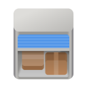

<h1 align="center">
  
  <br>
  Pods
</h1>

<p align="center"><strong>Manage your Podman containers</strong></p>

<p align="center">
  <a href="https://flathub.org/apps/details/com.github.marhkb.Pods">
    
  </a>
  <br>
</p>

<p align="center">
  <a href="https://hosted.weblate.org/engage/pods/">
    
  </a>
  <a href="https://github.com/marhkb/pods/actions/workflows/ci.yml">
    
  </a>
  <a href="https://flathub.org/apps/details/com.github.marhkb.Pods">
    
  </a>
</p>

<br>

<p align="center">
  
  
</p>

Pods is a frontend for podman. It uses libadwaita for its user interface and strives to meet the design principles of GNOME.

With Pods you can, among other things:

- Connect to local and remote Podman instances.
- Easily overview images, containers and pods.
- View prepared information about images, containers, and pods.
- Inspect images, containers and pods.
- View and search container logs.
- Monitor processes of containers and pods.
- Download images and build them using Dockerfiles.
- Create pods and containers.
- Control the lifecycle of containers and pods (in bulk) (start, stop, pause, etc.).
- Delete images, containers, and pods (in bulk).
- Prune images.
- Rename containers.

## 🔌 Installation

Install Pods from flathub by issuing

```shell
flatpak install com.github.marhkb.Pods
```

Pods can be kept up to date by issuing flatpak's update command like

```shell
flatpak update
```

You can also grab the latest CI build from [here](https://nightly.link/marhkb/pods/workflows/ci/main).
Then you need to unzip the archive's content and install the application with the command `flatpak install pods.flatpak`.
Keep in mind that you have to manually repeat this procedure to update the application.

## 🏗️ Developing

### Devcontainer

This repository includes a devcontainer setup, providing effective isolation between the host and the development environment.
It also simplifies development in any editor that supports devcontainers.

### Zed Editor

Thanks to the devcontainer setup, Zed can be used to develop Pods effortlessly. There are predefined Zed tasks that streamline the process.
Initially, the following three tasks need to be executed sequentially:

1. flatpak: init
2. flatpak: build dependencies
3. flatpak: run

Afterward, during development, only the last task needs to be executed.

### GNOME Builder

GNOME Builder is an plug and play method developing this application.
It can use Flatpak manifests to create a consistent building and running
environment cross-distro. Thus, it is highly recommended you use it.

1. Download [GNOME Builder](https://flathub.org/apps/details/org.gnome.Builder).
2. In Builder, click the "Clone Repository" button at the bottom, using `https://github.com/marhkb/pods.git` as the URL.
3. Click the build button at the top once the project is loaded.

### Meson

#### Prerequisites

The following packages are required to build Pods:

- meson >= 0.59
- ninja
- appstream-glib (for checks)
- cargo
- glib2 >= 2.66
- gtk4 >= 4.18
- libadwaita >= 1.7
- gtksourceview > 4.90
- vte-2.91-gtk4 >= 0.70

#### Build Instruction

```shell
git clone https://github.com/marhkb/pods.git
cd pods
meson _build --prefix=/usr/local
ninja -C _build install
```

## 🙌 Help translate Pods

You can help Pods translate into your native language. If you found any typos
or think you can improve a translation, you can use the [Weblate](https://hosted.weblate.org/engage/pods/) platform.

## 👨‍💻️ Code of Conduct

We adhere to the [GNOME Code of Conduct](/CODE_OF_CONDUCT.md) and expect all communications within this project to comply with it.

## 💝 Acknowledgment

The library [podman-api-rs](https://github.com/vv9k/podman-api-rs) provides a rust interface to the Podman API.
Without this great project, Pods would probably never have come into existence.

I also wanted to thank [SeaDve](https://github.com/SeaDve), from whom I took the [gettext](https://github.com/SeaDve/scripts/blob/0bd6f162ec8f2b3f0a9ad12816477fed934077db/gettext_rs.py) python script and whose projects like [Kooha](https://github.com/SeaDve/Kooha) and [Mousai](https://github.com/SeaDve/Mousai) served as inspiration for the README.

And also, a warm thank you to all the [contributors](https://github.com/marhkb/pods/graphs/contributors)
and [translators](https://hosted.weblate.org/engage/pods/) from Weblate.
